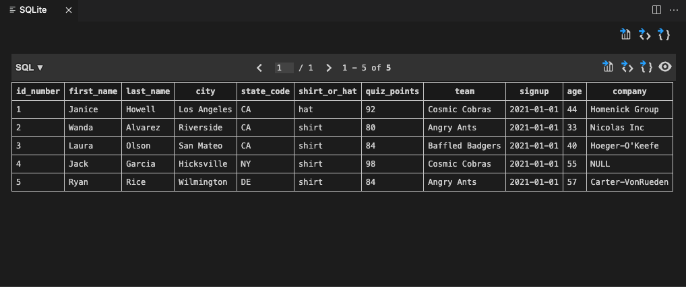

# Environment Setup

I like using VSCode and the only additional extension installed is SQLite (alexcvzz.vscode-sqlite)

1. Open project root folder
2. Open Command Palette 
3. Type `SQLite: Open Database`
4. Select **Exercise Files/SQLite/quizdata.db**

Now your environment is ready to run SQL on the quizdata database.

# Running SQL commands

Create a .sql file and you will be able to run the SQL command towards the connected database

I created `test.sql` for you to run query and visualize results

1. Open Command Palette
2. Type `SQLite: Run Query`

Expected output is:


# Close Database 

Once you are done, best practice is to close Database

1. Open Command Palette
2. Type `SQLite: Close Database`

# Introduction

## Database

- A collection of information, usually involving relationships between the data stored in it
- Imagine a table
    - Column: field
    - Row: record
- One or more tables make up a database

### Databases vs. Spreadsheets

- Both store data in fields and records
- Database tables can have specific relationships to each other
    - Database Schema
- Databases allow us to manage data and ask questions about data

## What is SQL?

- Structured Query Language (SQL) lets us formulate questions a database can respond to
- Write a question a computer can understand
- Express what you mean explictly
- Often is a series of smaller questions
- Adopted into manuy DBMSs

## SQL Statements

```SQL
/* SQL is whitespace independent. */
/* Statements are composed of clauses. */
/* Keywords are the CAPITAL LETTERS and they tell the database to take some action. */
/* Field and table names, i.e. first_name, last_name, quiz_results, state_code, specify where to look and what to look for. */
/* Predicates are conditions, and expressios represent values, i.e. 'CA' is the expression. */
/* Statement should end with a semicolon. */

SELECT first_name, last_name        -- clause
    FROM quiz_results               -- clause
    WHERE state_code = 'CA'         -- clause
    ORDER BY last_name ASC;         -- clause
```

- A SQL statement is any SQL code that takes some kind of action
- A SQL query is any statement that returns records

## Dual Roles of SQL

- As a data manipulation language (DML)
    - Edit data in the database
    - Create, read, update, or delete (CRUD) records 
- As a data definition language (DDL)
    - Edit the structure (schema) of the database
    - Add, change, or remove fields or tables

# Ask for Data from a Database

## Ask for data with SELECT

- The `SELECT` keyword tells the database we want some information returned to us. 

## Narrow down a query with WHERE

- The `WHERE` keyword lets us add selection criteria to a statement

# Adding more criteria to a statement

Be ware of syntax and make good use of `()`

